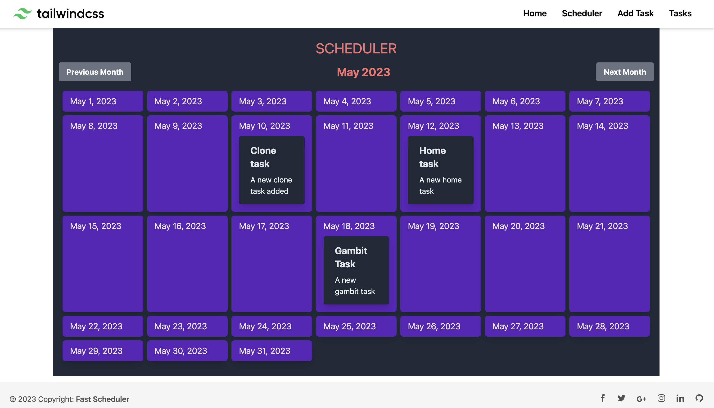

# Task Scheduler using Vue, Tailwind, Vite and Fast API

A task scheduler app which allows anonymous users to add tasks and view them in a custom calendar created using dayjs library.

## Tech Stack

The project back-end is created using Fast API in Python and Vue is used for the front-end. Tailwind CSS classes are used to style the UI components. For the database "Postgres" has been used.

## Introduction

It is a simple Kanban board application where you have four status 'To Do', 'In Progress', 'In Review' and 'Done'. You can create a generic task item and then through Kanban drag and drop dashboard, you can move items and save the updated status.

It has supoort for multi-user authentication.

## Updates

27/12/22 : Added Admin panel with support of being able to add users and tasks, modify any user or task for admin role user type.

## Screenshots

The style might be a subject to change in the future for this project. But, as of now this is how few pages look like

Add Task form.

Schduler which displays tasks in a calendar form.

List of all tasks

Mobile menu view, a sidebar opens which displays menu items on smaller screens.

## Deployment using Docker containers

To be done in future