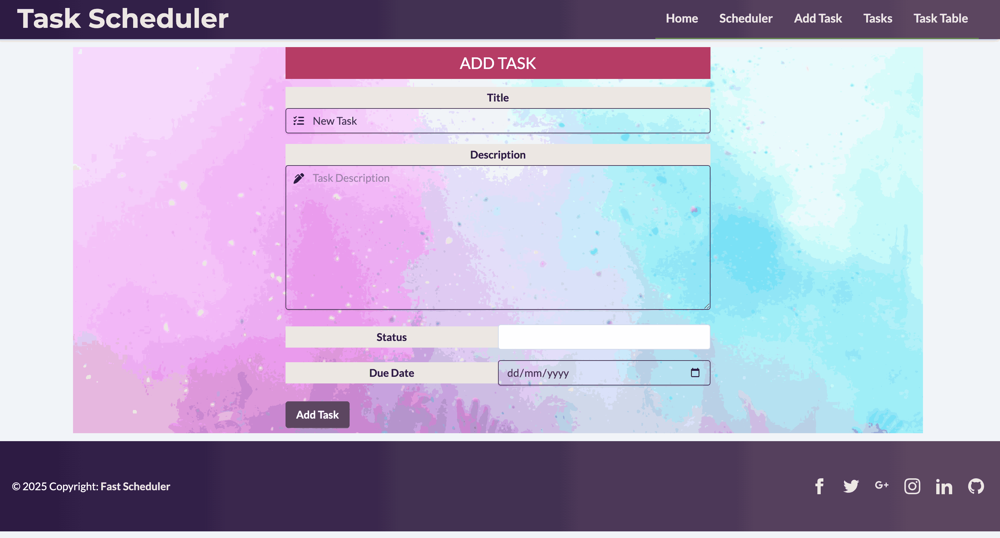
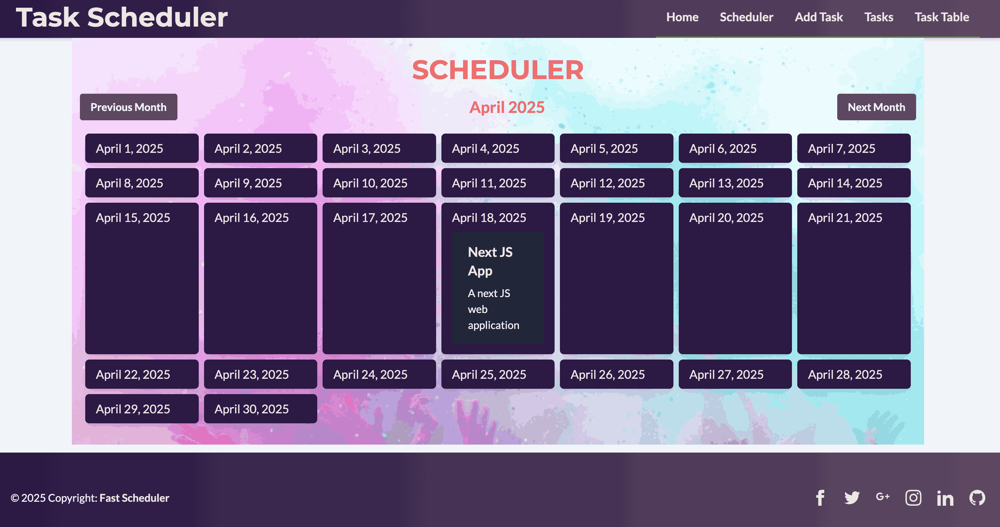
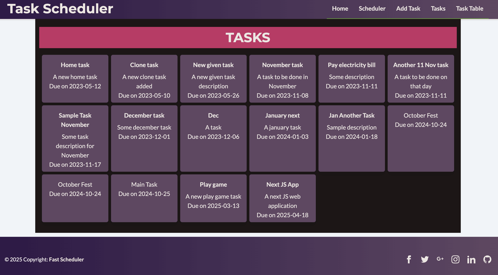
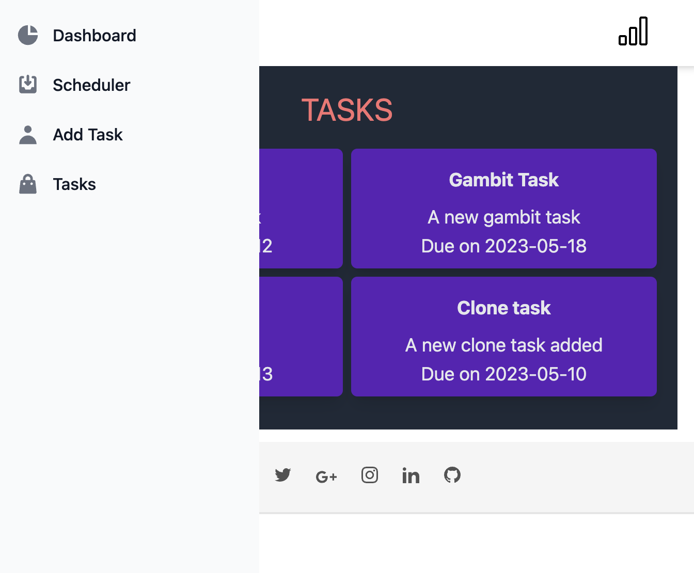

# Task Scheduler - Full-Stack Application

A modern task scheduler application built with Vue.js 3, FastAPI, and PostgreSQL. Features include task creation, management, calendar views, and multiple display formats with a responsive design.


## ✨ Features

- **📅 Calendar View** - Custom calendar using Dayjs for intuitive task scheduling
- **📊 Multiple Views** - Calendar, table, and list views for task management
- **🎨 Modern UI** - Responsive design with Tailwind CSS and FontAwesome icons
- **🚀 Full-Stack** - Vue.js 3 frontend with FastAPI backend
- **🐳 Containerized** - Docker-based deployment with all services
- **🔗 CORS-Free** - Nginx reverse proxy eliminates cross-origin issues
- **📱 Mobile Responsive** - Optimized for desktop and mobile devices
- **⚡ Hot Reload** - Development server with instant updates

## 🏗️ Architecture

### Technology Stack
- **Frontend**: Vue.js 3 + Composition API, Tailwind CSS, Vite
- **Backend**: FastAPI with Python 3.10+, SQLAlchemy ORM
- **Database**: PostgreSQL 15
- **Reverse Proxy**: Nginx (eliminates CORS)
- **Containerization**: Docker & Docker Compose

### Service Architecture
```
┌─────────────────┐    ┌──────────────────┐    ┌─────────────────┐
│   Frontend      │    │     Nginx        │    │    Backend      │
│   (Vue.js)      │────│   Reverse Proxy  │────│   (FastAPI)     │
│   Port: 8080    │    │   Port: 8080     │    │   Port: 8000    │
└─────────────────┘    └──────────────────┘    └─────────────────┘
                                                      │
                                              ┌─────────────────┐
                                              │   PostgreSQL     │
                                              │   Port: 5432     │
                                              └─────────────────┘
```

## 🚀 Quick Start

### Prerequisites
- Docker Desktop (Windows/Mac) or Docker Engine (Linux)
- Docker Compose (included with Docker Desktop)

### Installation & Setup

```bash
# Clone the repository
git clone <repository-url>
cd task-scheduler-in-vue-tailwind-and-fastapi

# Build and start all services
docker-compose up --build

# Access the application
# Frontend: http://localhost:8080
# Backend API: http://localhost:8000
# API Documentation: http://localhost:8000/docs
```

### Development Commands

| Command | Description |
|---------|-------------|
| `docker-compose up --build` | Build and start all services |
| `docker-compose up -d` | Start in background |
| `docker-compose down` | Stop all services |
| `docker-compose down -v` | Stop and remove all data (fresh start) |
| `docker-compose logs -f` | View real-time logs |
| `docker-compose ps` | Check service status |
| `docker-compose exec backend python -m pytest` | Run backend tests |
| `docker-compose exec frontend nginx -t` | Test Nginx configuration |

## 📱 Application Features

### Task Management
- **Create Tasks** - Add new tasks with title, description, due date, and status
- **Update Tasks** - Edit existing task details and status
- **Multiple Views** - View tasks in calendar, table, or list format
- **Status Tracking** - Track task progress through different stages

### User Interface
- **Responsive Design** - Works seamlessly on desktop and mobile devices
- **Modern UI** - Clean, intuitive interface with Tailwind CSS
- **Interactive Calendar** - Custom calendar component for task visualization
- **Mobile Menu** - Sidebar navigation for smaller screens

## 📷 Screenshots

### Task Creation Form


### Calendar Scheduler View


### Task Management Views



### Mobile Responsive Design


## 📁 Project Structure

```
task-scheduler-in-vue-tailwind-and-fastapi/
├── backend/                    # FastAPI backend
│   ├── tasks/                  # Task management module
│   │   ├── model.py           # SQLAlchemy ORM models
│   │   ├── router.py          # FastAPI route definitions
│   │   ├── schema.py          # Pydantic validation schemas
│   │   └── services.py        # Business logic layer
│   ├── db.py                  # Database connection management
│   ├── config.py              # Configuration settings
│   └── main.py                # FastAPI application entry
├── client/                     # Vue.js frontend
│   ├── src/
│   │   ├── components/        # Reusable UI components
│   │   ├── pages/            # Route components
│   │   ├── App.vue           # Root component
│   │   ├── main.js           # Application entry point
│   │   └── routes.js         # Vue Router configuration
│   ├── Dockerfile            # Multi-stage build (Node.js + Nginx)
│   └── nginx.conf            # Nginx reverse proxy
├── alembic/                   # Database migrations
├── docs/                     # Documentation
├── docker-compose.yaml        # Docker service configuration
├── requirements.txt           # Python dependencies
└── README.md                 # This file
```

## 🔧 Development

### Backend Development
```bash
# Install dependencies
pip install -r requirements.txt

# Run database migrations
alembic upgrade head

# Start development server
uvicorn main:app --reload
```

### Frontend Development
```bash
cd client

# Install dependencies
npm install

# Start development server
npm run dev

# Build for production
npm run build
```

### Database Management
```bash
# Create new migration
alembic revision --autogenerate -m "description"

# Check migration history
alembic history

# Downgrade database
alembic downgrade -1
```

## 📚 Documentation

- **[CLAUDE.md](./CLAUDE.md)** - AI development assistant guidelines
- **[docs/DOCUMENTATION.md](./docs/DOCUMENTATION.md)** - Complete documentation guide
- **[docs/DOCKER.md](./docs/DOCKER.md)** - Docker configuration and deployment
- **[docs/CORS.md](./docs/CORS.md)** - CORS handling and API routing

## 🧪 Testing

### Backend Tests
```bash
# Run all tests
docker-compose exec backend python -m pytest

# Run with coverage
docker-compose exec backend python -m pytest --cov=backend
```

### Frontend Testing
- Manual testing via development server with hot reload
- Automated testing setup can be added as needed

## 🔍 API Documentation

The FastAPI backend provides auto-generated OpenAPI documentation:
- **Swagger UI**: http://localhost:8000/docs
- **ReDoc**: http://localhost:8000/redoc

### Key API Endpoints
- `GET /tasks` - Retrieve all tasks
- `POST /tasks` - Create new task
- `PUT /tasks/{id}` - Update existing task
- `DELETE /tasks/{id}` - Delete task

## 🚨 Troubleshooting

### Common Issues

#### Port Conflicts
- Frontend: 8080, Backend: 8000
- If ports are in use, modify mappings in `docker-compose.yaml`

#### Database Issues
- Check `docker-compose logs db` for PostgreSQL errors
- Verify database service shows "(healthy)" in `docker-compose ps`
- Access database directly: `docker-compose exec db psql -U scheduler -d scheduler`

#### API Connection Issues
- Test backend directly: `curl http://localhost:8000/docs`
- Verify nginx configuration: `docker-compose exec frontend nginx -t`
- Check service connectivity: `docker-compose exec frontend ping backend`

#### Service Startup Issues
- Ensure all services are healthy: `docker-compose ps`
- View service logs: `docker-compose logs -f [service-name]`
- Restart services: `docker-compose restart [service-name]`

## 🤝 Contributing

1. **Check TASKS.md** - Review current tasks and add new ones
2. **Follow Guidelines** - Adhere to code standards and file size limits
3. **Write Tests** - Include tests for new functionality
4. **Update Documentation** - Keep documentation current with changes

## 📄 License

This project is open source and available under the [MIT License](LICENSE).

## 🔗 Links

- **Vue.js Documentation**: https://vuejs.org/
- **FastAPI Documentation**: https://fastapi.tiangolo.com/
- **Tailwind CSS**: https://tailwindcss.com/
- **Docker Documentation**: https://docs.docker.com/

## 🐳 Deployment using Docker Containers

The application is fully containerized using Docker and Docker Compose, making it easy to deploy and run in any environment.

### Quick Start

```powershell
# Clone the repository
git clone <repository-url>
cd task-scheduler-in-vue-tailwind-and-fastapi

# Build and start all services
docker-compose up --build

# Access the application
# Frontend: http://localhost:8080
# Backend API: http://localhost:8000
# API Documentation: http://localhost:8000/docs
```

### Prerequisites

- Docker Desktop (Windows/Mac) or Docker Engine (Linux)
- Docker Compose (included with Docker Desktop)

### 📚 Documentation

Complete documentation is available in the `docs/` folder:

- **[Complete Documentation Guide](./docs/DOCUMENTATION.md)** - Start here for full overview
- **[Docker Configuration & Deployment](./docs/DOCKER.md)** - Docker setup, Dockerfiles, and services
- **[CORS & API Reverse Proxy](./docs/CORS.md)** - How CORS issues are avoided and API routing

### Common Commands

| Command | Description |
|---------|-------------|
| `docker-compose up --build` | Build and start all services |
| `docker-compose up -d` | Start in background |
| `docker-compose down` | Stop all services |
| `docker-compose logs -f` | View real-time logs |
| `docker-compose ps` | Check service status |

### Architecture

Three containerized services:

1. **PostgreSQL Database** - Port 5432 (internal)
2. **FastAPI Backend** - Port 8000
3. **Vue.js + Nginx Frontend** - Port 8080

### For More Information

👉 **See [docs/DOCUMENTATION.md](./docs/DOCUMENTATION.md)** for:
- Complete setup guide
- Architecture diagrams
- Troubleshooting
- Development guidelines
- Environment configuration
- Production deployment

### Key Features

- ✅ Fully containerized with Docker
- ✅ CORS-free architecture via Nginx reverse proxy
- ✅ Automatic database migrations
- ✅ Persistent data storage
- ✅ Health checks and service dependencies
- ✅ Production-ready configuration
