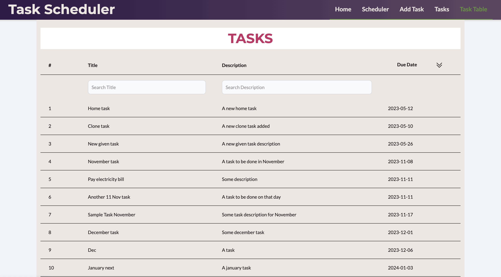

# Task Scheduler using Vue, Tailwind, Vite and Fast API

A task scheduler app which allows anonymous users to add tasks and view them in a custom calendar created using dayjs library.


## 💻 Tech Stack 

The project back-end is created using Fast API in Python and Vue is used for the front-end. Tailwind CSS classes are used to style the UI components. For the database "Postgres" has been used.

## 📄 Introduction

It is a simple Kanban board application where you have four status 'To Do', 'In Progress', 'In Review' and 'Done'. You can create a generic task item and then through Kanban drag and drop dashboard, you can move items and save the updated status.

It has supoort for multi-user authentication.


## 🚀 Deployment Instructions (Docker Compose)

1. **Clone the repository:**
	```bash
	git clone <repo-url>
	cd task-scheduler-in-vue-tailwind-and-fastapi
	```

2. **Start all services:**
	```bash
	docker compose up --build
	```
	This will build and start the following containers:
	- **db**: PostgreSQL database
	- **web**: FastAPI backend server
	- **alembic**: Runs database migrations
	- **client**: Vue.js frontend (served on port 8080)

3. **Access the app:**
	- Frontend: [http://localhost:8080](http://localhost:8080)
	- Backend API: [http://localhost:8000](http://localhost:8000)
	- PostgreSQL: Port 5432 (for development)


## ✏️ Updates

27/12/22 : Added Admin panel with support of being able to add users and tasks, modify any user or task for admin role user type.

## 📷 Screenshots

The style might be a subject to change in the future for this project. But, as of now this is how few pages look like

Add Task form.


## 📁 Project Structure

- `main.py`: FastAPI entrypoint
- `backend/`: Backend logic (models, routers, services)
- `client/`: Vue.js frontend app
	- `src/pages/`: Main views
	- `src/components/`: Reusable UI components
- `alembic/`: Database migration scripts
- `requirements.txt`: Python dependencies
- `client/package.json`: Frontend dependencies
- `docker-compose.yml`: Multi-service container orchestration
- `Dockerfile`: Backend build instructions
- `client/Dockerfile`: Frontend build instructions


Schduler which displays tasks in a calendar form.


List of all tasks, calendar view and table view





Mobile menu view, a sidebar opens which displays menu items on smaller screens.


## Deployment using Docker containers


## ⚙️ Docker Configuration

- **Services:**
	- `db`: Uses official PostgreSQL 15 image, persistent volume `db_data`
	- `web`: FastAPI backend, environment variables for DB connection
	- `alembic`: Runs Alembic migrations after DB is ready
	- `client`: Builds and serves Vue app on port 8080

- **Environment Variables:**
	- Database credentials and connection info are set for backend and Alembic containers.
	- Default values:
		- `DATABASE_USERNAME=taskscheduler_user`
		- `DATABASE_PASSWORD=taskpassword`
		- `DATABASE_HOST=db`
		- `DATABASE_PORT=5432`
		- `DATABASE_NAME=taskdb`

- **Volumes:**
	- `db_data`: Persists PostgreSQL data

- **Dependencies:**
	- `web` and `alembic` depend on `db`
	- `client` depends on `web`

## ⚙️ Backend Database Configuration

The backend uses environment variables to configure the PostgreSQL database connection. You can set these variables in your environment or in a `.env` file before starting the FastAPI server:

- `DATABASE_USERNAME`: Database username (default: `taskscheduler_user`)
- `DATABASE_PASSWORD`: Database password (default: `taskpassword`)
- `DATABASE_HOST`: Database host (default: `localhost`)
- `DATABASE_PORT`: Database port (default: `5432`)
- `DATABASE_NAME`: Database name (default: `taskdb`)

If any variable is not set, the default value will be used.
